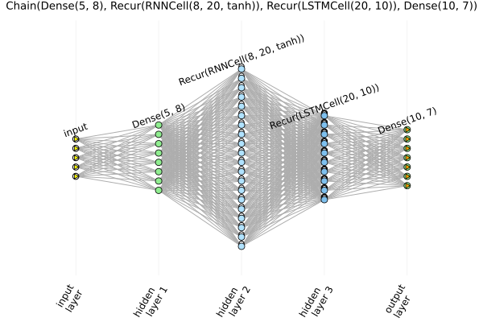
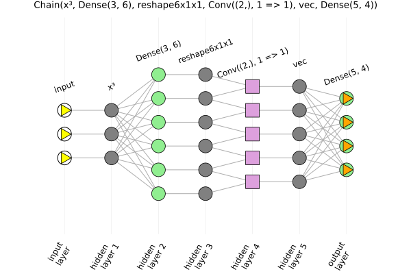
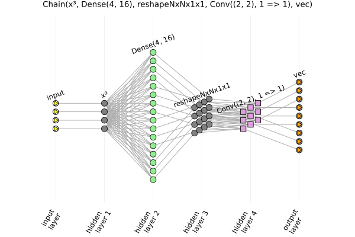
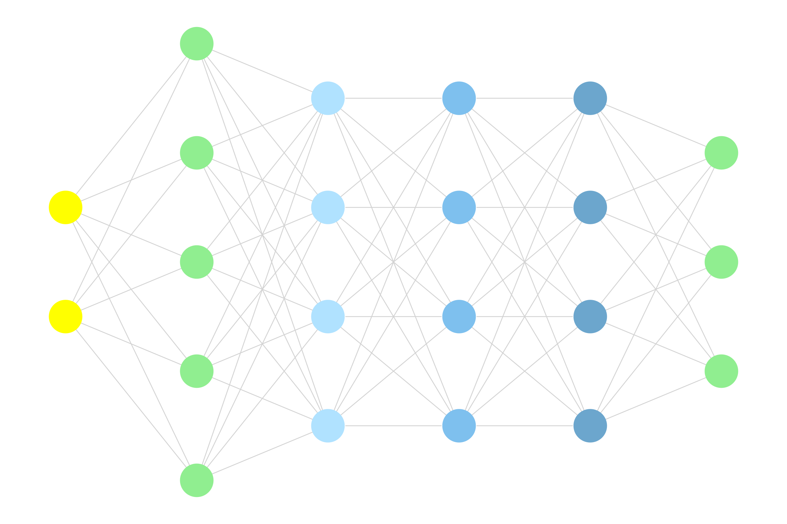

# ChainPlot

Plot recipes and graph generator of the topology of [FluxML/Flux.jl](https://github.com/FluxML/Flux.jl)'s neural networks composed with [Flux.Chain](https://fluxml.ai/Flux.jl/stable/models/layers/#Flux.Chain).

## Description

It implements a plot recipe for `Flux.Chain` using the recipe tool from [JuliaPlots/RecipesBase.jl](https://github.com/JuliaPlots/RecipesBase.jl).

It also generates a [MetaGraph.jl](https://github.com/JuliaGraphs/MetaGraphs.jl) from the `Flux.Chain`. The Plot recipe is built from the generated `metagraph`.

This repository is for prototyping the recipe. It is not, at first, intended to become a registered Julia package. Instead, the aim is to PR it into [FluxML/Flux.jl](https://github.com/FluxML/Flux.jl). Or, maybe, a separate package in [FluxML](https://github.com/FluxML).

Nevertheless, one is welcome to install it directly via github, use it, and contribute to improve it.

## Current state

The aim is to obtain a pictorial representations for all types of layers implemented with [Flux.Chain](https://fluxml.ai/Flux.jl/stable/models/layers/#Flux.Chain) and in a way similar to the representations given in the following links:

* [Main Types of Neural Networks and its Applications — Tutorial](https://pub.towardsai.net/main-types-of-neural-networks-and-its-applications-tutorial-734480d7ec8e); and

* [The mostly complete chart of Neural Networks, explained](https://towardsdatascience.com/the-mostly-complete-chart-of-neural-networks-explained-3fb6f2367464).

At the moment, the recipe works for Dense and Recurrent layers, for  taylor-made functional layers, and with partial visualization for Convolutional and Pooling layers, in the sense that only 1d and 2d views are available, and with the 2d visualization not being that great yet. But hopefully soon there will be a proper multidimensional visualization for them, as well. Batch lots are not properly shown either; they all collapse into a single batch.

There is a distinction between netwoks starting with a layer with fixed-size input (Dense and Recurrent) and networks starting with a layer with variable-size input (Convolutional,  Pooling, and functional).

In the former case, just passing a network `m=Chain(...)` to plot works, e.g. `plot(m)`. In the latter case, one needs to pass along an initial input `a` as the second argument, like `plot(m,a)`, so that the plot recipe can properly figure out the size of each layer.

Any other argument for plot is accepted, like `plot(m,a, title="Convolutional network with $(length(m)) layers")`

In this new version, one can also obtain a metagraph with `mg = chaingraph(m)` or `mg = chaingraph(m,a)`. The current attributes can be seen in the docstring for `chaingraph`.

## Examples

Here is a little taste of the current state.

In all the examples below, one needs `Flux`, `ChainPlot` and `Plots`, while for the graph one needs `Graphs` and `MetaGraphs`.

```julia
julia> using Flux

julia> using ChainPlot

julia> using Plots

julia> gr()
Plots.GRBackend()
```

### Dense and Recurrent layers with a gruvbox_light theme

In our first example, we do it with two plot themes: `gruvbox_light` and `default`:

```julia
julia> theme(:gruvbox_light)

julia> nnr = Chain(Dense(2,5,σ),RNN(5,4,relu), LSTM(4,4), GRU(4,4), Dense(4,3))
Chain(Dense(2, 5, σ), Recur(RNNCell(5, 4, relu)), Recur(LSTMCell(4, 4)), Dense(4, 3))

julia> plot(nnr, title="With theme solarized_light", titlefontsize=10)
```


and

```julia
julia> theme(:default)

julia> plot(nnr, title="With theme default", titlefontsize=10)
```


### A wide neural network

Another example:

```julia
julia> theme(:default)

julia> nnrlwide = Chain(Dense(5,8,relu), RNN(8,20), LSTM(20,10), Dense(10,7))
Chain(Dense(5, 8, relu), Recur(RNNCell(8, 20, tanh)), Recur(LSTMCell(20, 10)), Dense(10, 7))

julia> plot(nnrlwide, title="$nnrlwide", titlefontsize=9)
```



### Variable-input layer

Variable-input functional layers are also accepted. If given as the first layer, then an initial input must be provided, otherwise, the input data is not needed. Here are two examples, illustrating each case.

```julia
julia> dx(x) = x[2:end]-x[1:end-1]
dx (generic function with 1 method)

julia> x³(x) = x.^3
x³ (generic function with 1 method)

julia> nna = Chain(Dense(2,5,σ), dx, RNN(4,6,relu), x³, LSTM(6,4), GRU(4,4), Dense(4,3))
Chain(Dense(2, 5, σ), dx, Recur(RNNCell(4, 6, relu)), x³, Recur(LSTMCell(6, 4)), Recur(GRUCell(4, 4)), Dense(4, 3))

julia> plot(nna, title="$nna", titlefontsize=7)
```


```julia
julia> nnx = Chain(x³, dx, LSTM(5,10), Dense(10,5))
Chain(x³, dx, Recur(LSTMCell(5, 10)), Dense(10, 5))

julia> input_data = rand(6);

julia> plot(nnx, input_data, title="$nnx", titlefontsize=9)
```


### Convolutional networks

A neural network with a one-dimensional convolutional layer

```julia
julia> reshape6x1x1(a) = reshape(a, 6,  1, 1)
reshape6x1x1 (generic function with 1 method)

julia> slice(a) = a[:,1,1]
slice (generic function with 1 method)

julia> nnrs = Chain(x³, Dense(3,6), reshape6x1x1, Conv((2,), 1=>1), slice, Dense(5,4))
Chain(x³, Dense(3, 6), reshape6x1x1, Conv((2,), 1=>1), slice, Dense(5, 4))

julia> plot(nnrs, Float32.(rand(3)), title="$nnrs", titlefontsize=9)
```



Now with a two-dimensional convolution, but with a one-dimensional visualization (of the convolutional layer).

```julia
julia> reshape4x4x1x1(a) = reshape(a, 4, 4, 1, 1)
reshape4x4x1x1 (generic function with 1 method)

julia> nnrs2d = Chain(x³, Dense(4,16), reshape4x4x1x1, Conv((2,2), 1=>1), slice)
Chain(x³, Dense(4, 16), reshape4x4x1x1, Conv((2, 2), 1=>1), slice)

julia> plot(nnrs2d, Float32.(rand(4)), title="$nnrs2d", titlefontsize=9)
```



### From Chain to MetaGraph

With `ChainPlot.chaingraph()` we can convert a `Flux.Chain` to a `MetaGraph`.

```julia
julia> using ChainPlot

julia> using Graphs

julia> using MetaGraphs

julia> using Flux

julia> nnr = Chain(Dense(2,5,σ),RNN(5,4,relu), LSTM(4,4), GRU(4,4), Dense(4,3))
Chain(Dense(2, 5, σ), Recur(RNNCell(5, 4, relu)), Recur(LSTMCell(4, 4)), Recur(GRUCell(4, 4)), Dense(4, 3))

julia> mg_nnr = chaingraph(nnr)
{22, 74} undirected Int64 metagraph with Float64 weights defined by :weight (default weight 1.0)

julia> get_prop(mg_nnr, 1, :layer_type)
:input_layer

julia> get_prop(mg_nnr, 3, :layer_type)
Dense(2, 5, σ)

julia> get_prop(mg_nnr, 7, :index_in_layer)
(5,)

julia> first(edges(mg_nnr)).src
1

julia> first(edges(mg_nnr)).dst
3

julia> outdegree(mg_nnr, 12)
8

julia> get_prop.(Ref(mg_nnr), 15, [:loc_x, :loc_y])
2-element Vector{Real}:
 3.0
 0.75
```

### Visualizing the MetaGraph

We may visualize the generated MetaGraph with [JuliaGraphs/GraphPlot.jl](https://github.com/JuliaGraphs/GraphPlot.jl). We use the attributes `:loc_x`, `:loc_y`, and `:neuron_color` to properly position and color every neuron.

For that, however, we need a bunch of other packages, besides those already loaded as mentioned above.

```julia
julia> using Colors

julia> using Cairo

julia> using Compose

julia> using GraphPlot

julia> nnr = Chain(Dense(2,5,σ),RNN(5,4,relu), LSTM(4,4), GRU(4,4), Dense(4,3))
Chain(Dense(2, 5, σ), Recur(RNNCell(5, 4, relu)), Recur(LSTMCell(4, 4)), Recur(GRUCell(4, 4)), Dense(4, 3))

julia> mg_nnr = ChainPlot.chaingraph(nnr)
{22, 65} undirected Int64 metagraph with Float64 weights defined by :weight (default weight 1.0)

julia> locs_x = [get_prop(mg_nnr, v, :loc_x) for v in vertices(mg_nnr)]
22-element Vector{Float64}:
 0.0
 0.0
 1.0
 1.0
 ⋮
 5.0
 5.0
 5.0

julia> locs_y = [get_prop(mg_nnr, v, :loc_y) for v in vertices(mg_nnr)]
22-element Vector{Float64}:
 0.4166666666666667
 0.5833333333333334
 0.16666666666666666
 0.3333333333333333
 ⋮
 0.3333333333333333
 0.5
 0.6666666666666666

julia> nodefillc = [parse(Colorant, get_prop(mg_nnr, v, :neuron_color)) for v in vertices(mg_nnr)]
22-element Array{RGB{N0f8},1} with eltype RGB{FixedPointNumbers.N0f8}:
 RGB{N0f8}(1.0,1.0,0.0)
 RGB{N0f8}(1.0,1.0,0.0)
 RGB{N0f8}(0.565,0.933,0.565)
 RGB{N0f8}(0.565,0.933,0.565)
 ⋮
 RGB{N0f8}(0.565,0.933,0.565)
 RGB{N0f8}(0.565,0.933,0.565)
 RGB{N0f8}(0.565,0.933,0.565)

julia> draw(PNG("img/mg_nnr.png", 600, 400), gplot(mg_nnr, locs_x, locs_y, nodefillc=nodefillc))
```

And here is the result.



### Other examples

Other examples can be seen in [examples/examples.jl](examples/examples.jl), with all the plots saved to the folder [examples/img](examples/img/).

## Roadmap

There is a lot to be done:

* Visualization for multidimensional layers.
* Optimization of the plot recipe (large networks take too long, and sometimes plotting seem to hang, but building just the graph works fine).
* Add other plotting options (e.g. not annotate the plot with the type of the layer; only use circles as markers since they are accepted by all the backends)

## Compatibility

Packages tested or to be tested: Plots.jl, Plotly.jl, PlotlyJS.jl, Gadfly.jl.

### Plots.jl

This depends on the backend and on the themes. I haven't tried all combinations. Themes were just tested with the `gr()` backend

See [Plots backends](https://docs.juliaplots.org/latest/backends/)

#### GR backend

* This works fine.

#### PyPlot backend

* Get Warning: pyplot() backend does not have :rtriangle and seems not to scale properly.

#### Plotly and PlotlyJS backends

* Get Error: plotly() and plotlyjs() do not support custom shapes

#### UnicodePlots backend

* custom shapes and :rtriangle are unsupported. Choose from: [:none, :auto, :circle]

#### HDF5 backend

* It is working partially. Neurons are not showing up. On the other hand, despite saying in Plots's page that it is currently missing support for SeriesAnnotations, this seems to be working, since SeriesAnnotations is used to display the type/activation function of each layer.

#### Backends not tried yet

* InspectDR
* Plotly
* PlotlyJS
* Gadfly
