# Examples

The aim of `ChainPlot.jl` is to provide a visualization of the topology of a neural network constructed with `Flux.Chain`. It does that by applying a `Plots.jl` recipe. The recipe is built by first constructing a `MetaGraph`.

Here, we consider some examples of building both a MetaGraph and some plots.

## Load Packages

First we load some packages:

````julia
using Flux
using Plots
using Random
using Colors
using Cairo
using Compose
using Graphs
using MetaGraphs
using GraphPlot
````

and, of course, `ChainPlot`:

````julia
include("../src/ChainPlot.jl")

using .ChainPlot
````

We play with different themes for `Plots.jl`, so we collect them here:

````julia
themes = [
    :default
    :dark
    :ggplot2
    :juno
    :lime
    :orange
    :sand
    :solarized
    :solarized_light
    :wong
    :wong2
    :gruvbox_dark
    :gruvbox_light
]
````

````
13-element Vector{Symbol}:
 :default
 :dark
 :ggplot2
 :juno
 :lime
 :orange
 :sand
 :solarized
 :solarized_light
 :wong
 :wong2
 :gruvbox_dark
 :gruvbox_light
````

We start with the default one:

````julia
gr()
theme(:default)
````

## Chain to MetaGraph

We first consider a neural network with several different types of layers and building a MetaGraph from it.

Here is the neural network:

````julia
nnr = Chain(Dense(2, 5, σ), RNN(5, 4, relu), LSTM(4, 4), GRU(4, 4), Dense(4, 3))
````

````
Chain(
  Dense(2, 5, σ),                       # 15 parameters
  Recur(
    RNNCell(5, 4, relu),                # 44 parameters
  ),
  Recur(
    LSTMCell(4, 4),                     # 152 parameters
  ),
  Recur(
    GRUCell(4, 4),                      # 112 parameters
  ),
  Dense(4, 3),                          # 15 parameters
)         # Total: 17 trainable arrays, 338 parameters,
          # plus 4 non-trainable, 16 parameters, summarysize 2.391 KiB.
````

The MetaGraph is built with the function `ChainPlot.chaingraph`:

````julia
mg_nnr = ChainPlot.chaingraph(nnr)
````

````
{22, 74} undirected Int64 metagraph with Float64 weights defined by :weight (default weight 1.0)
````

We can already see the number of vertices and edges in this graph.

We can also look at the first vertice for all the attributes it contains:

````julia
mg_nnr.vprops[1]
````

````
Dict{Symbol, Any} with 7 entries:
  :loc_y => 0.416667
  :neuron_color => :yellow
  :layer_number => 0
  :layer_type => "input layer"
  :index_in_layer => (1,)
  :layer_center => 1.0
  :loc_x => 0.0
````

The two attributes `locs_x` and `locs_y` give the coordinates of each vertice, while `neuron_color` gives the color based on the type of layer, whether dense, recurrent, convolutional, etc.

We can get the list of those attributes for all the vertices and use them to plot the topology of the network with `GraphPlot`:

````julia
locs_x = [get_prop(mg_nnr, v, :loc_x) for v in vertices(mg_nnr)]
locs_y = [get_prop(mg_nnr, v, :loc_y) for v in vertices(mg_nnr)]
nodefillc = [parse(Colorant, get_prop(mg_nnr, v, :neuron_color)) for v in vertices(mg_nnr)]
plt = gplot(mg_nnr, locs_x, locs_y, nodefillc=nodefillc)
````
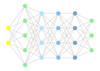

````julia
draw(PNG("img/mg_nnr.png", 600, 400), plt)
````

## Now with Plots.jl

It is easier, however, to use a `Plots.jl` recipe, as we show here.

### Single layer networks

For illustrative purposes, we start with some simple, single-layer networks:

````julia
dl = Dense(2, 3)
plot(dl, title="$dl", titlefontsize=12)
````
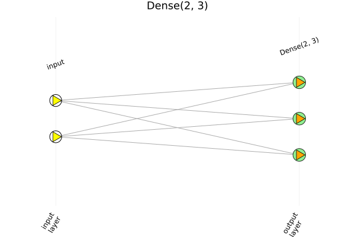

````julia
savefig("img/dl.png")
@info "img/dl.png"
````

````
[ Info: img/dl.png

````

````julia
rl = RNN(3, 5)
plot(rl, title="$rl", titlefontsize=12)
````
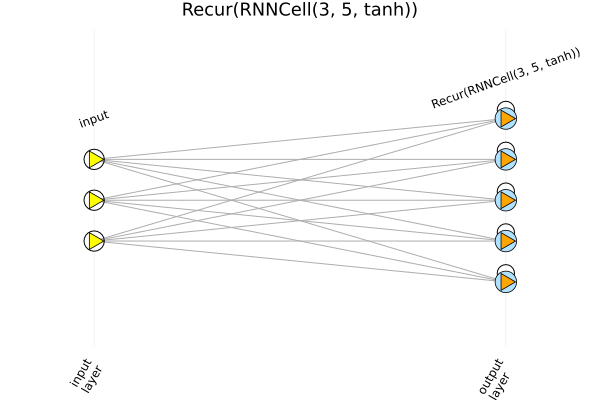

````julia
savefig("img/rl.png")
````

````julia
llstm = LSTM(4, 7)
plot(llstm, title="$llstm", titlefontsize=12)
````
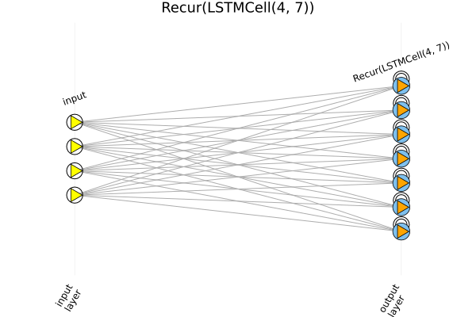

````julia
savefig("img/llstm.png")
````

````julia
lgru = GRU(5, 7)
plot(lgru, title="$lgru", titlefontsize=12)
````
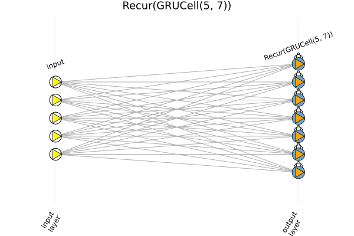

````julia
savefig("img/lgru.png")
````

## Multilayer networks

````julia
nnd = Chain(Dense(2, 5), Dense(5, 7, σ), Dense(7, 2, relu), Dense(2, 3))
plot(nnd, title="$nnd", titlefontsize=10, xaxis=nothing)
````
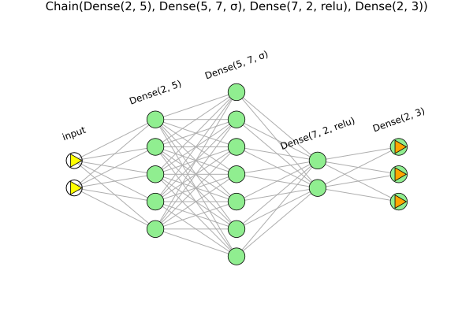

````julia
savefig("img/nnd.png")
````

````julia
nnr = Chain(Dense(2, 5, σ), RNN(5, 4, relu), LSTM(4, 4), GRU(4, 4), Dense(4, 3))
plot(nnr, title="$nnr", titlefontsize=7)
````
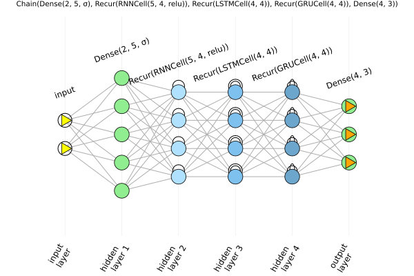

````julia
savefig("img/nnr.png")
````

````julia
dx(x) = x[2:end] - x[1:end-1]
x³(x) = x .^ 3
nna = Chain(Dense(2, 5, σ), dx, RNN(4, 6, relu), x³, LSTM(6, 4), GRU(4, 4), Dense(4, 3))
plot(nna, title="$nna", titlefontsize=7)
````


````julia
savefig("img/nna.png")
````

````julia
nnx = Chain(x³, dx, LSTM(5, 10), Dense(10, 5))
input_data = rand(6)
plot(nnx, input_data, title="$nnx", titlefontsize=9)
````
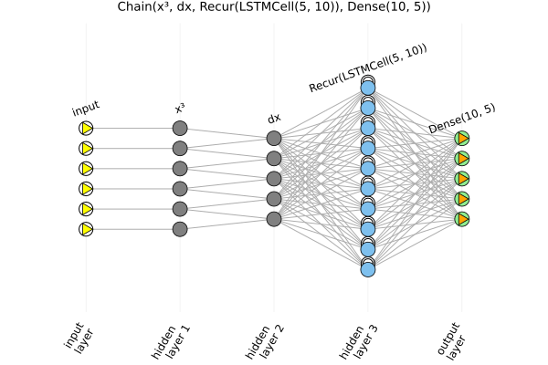

````julia
savefig("img/nnx.png")
````

````julia
nnrlwide = Chain(Dense(5, 8), RNN(8, 20), LSTM(20, 10), Dense(10, 7))
plot(nnrlwide, title="$nnrlwide", titlefontsize=9)
````
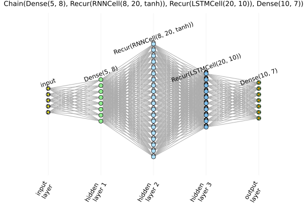

````julia
savefig("img/nnrlwide.png")
````

````julia
reshape6x1x1(a) = reshape(a, 6, 1, 1)
nnrs = Chain(x³, Dense(3, 6), reshape6x1x1, Conv((2,), 1 => 1), vec, Dense(5, 4))
plot(nnrs, Float32.(rand(3)), title="$nnrs", titlefontsize=9)
````


````julia
savefig("img/nnrs.png")
````

````julia
N = 4
reshapeNxNx1x1(a) = reshape(a, N, N, 1, 1)
nnrs2d = Chain(x³, Dense(4, N^2), reshapeNxNx1x1, Conv((2, 2), 1 => 1), vec)
plot(nnrs2d, Float32.(rand(4)), title="$nnrs2d", titlefontsize=9)
````


````julia
savefig("img/nnrs2d.png")
````

````julia
nnc = Chain(Conv((3,3), 1=>2))
plot(nnc, rand(Float32, 10, 10, 1, 1), title="$nnc", titlefontsize=10)
````


````julia
savefig("img/nnc.png")
````

````julia
nncg = Chain(Conv((3,3), 1=>4, leakyrelu, pad = 1),GroupNorm(4,2))
plot(nncg, Float32.(rand(6,6,1,1)), title="$nncg", titlefontsize=10)
````


````julia
savefig("img/nncg.png")
````

````julia
hdf5()
plot(nnr, title="$nnr with HDF5", titlefontsize=7)
Plots.hdf5plot_write("img/nnrhdf5.hdf5")
gr()
plthdf5_read = Plots.hdf5plot_read("img/nnrhdf5.hdf5")
````
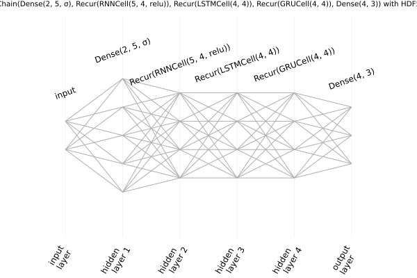

### Plotting with different themes

````julia
gr()
plts = []
for t in themes
    theme(t)
    try
        push!(plts, plot(nnr, title="With theme $t", titlefontsize=10, show=true))
        display(plts[end])
        #
        savefig("img/nnr_$t.png")
    catch err
        @warn "Error in chain plot with theme $t: $err"
    end
end
````


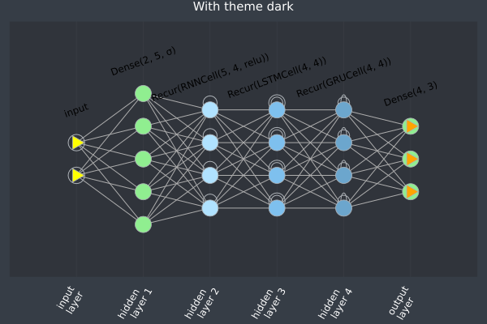
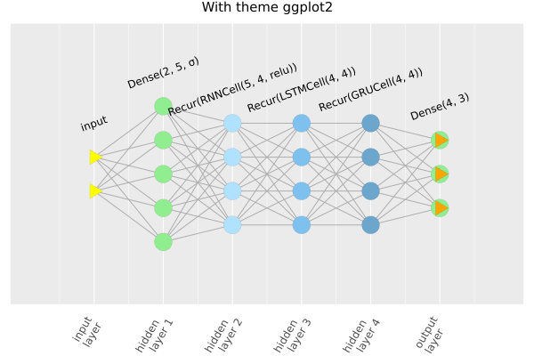
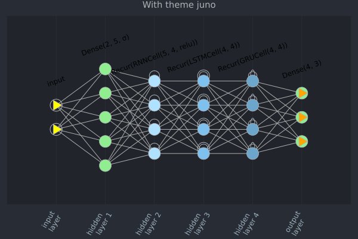
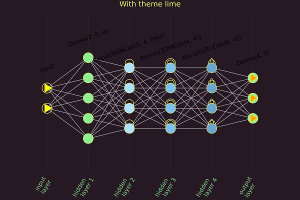
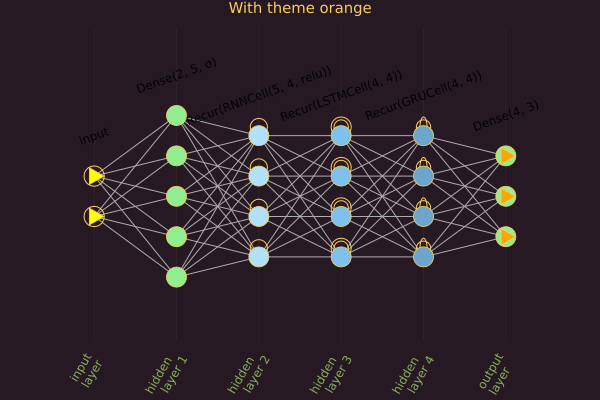
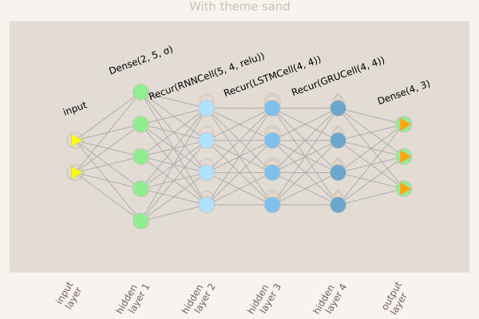
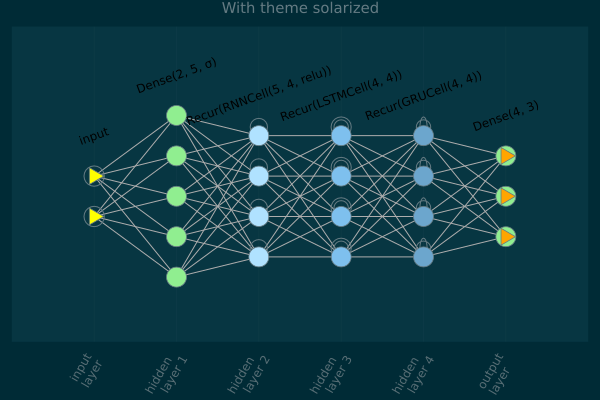
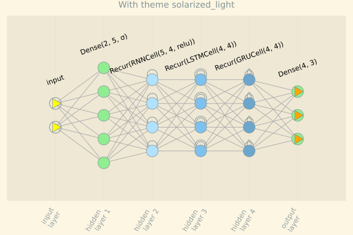
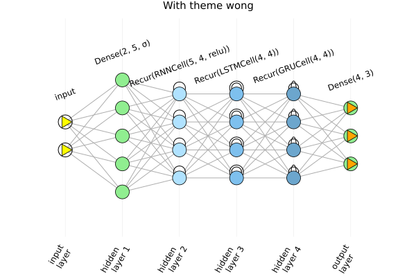

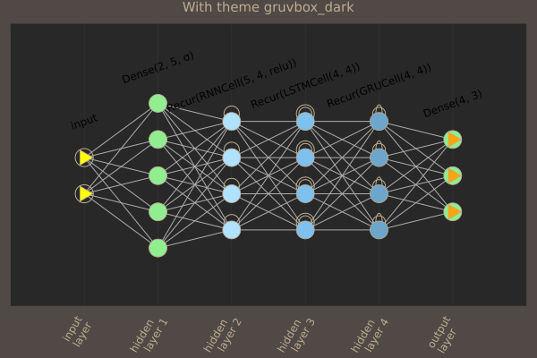
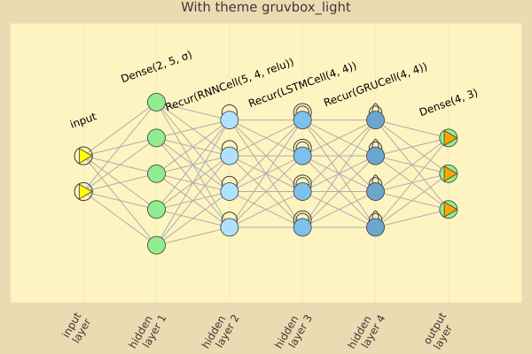

Back to `:default` theme.

````julia
theme(:default)
````

---

*This page was generated using [Literate.jl](https://github.com/fredrikekre/Literate.jl), with*
*`Literate.markdown("examples.jl", "build", execute = true, flavor = Literate.CommonMarkFlavor(), postprocess = s -> replace(s, ", credit=false)`.*

